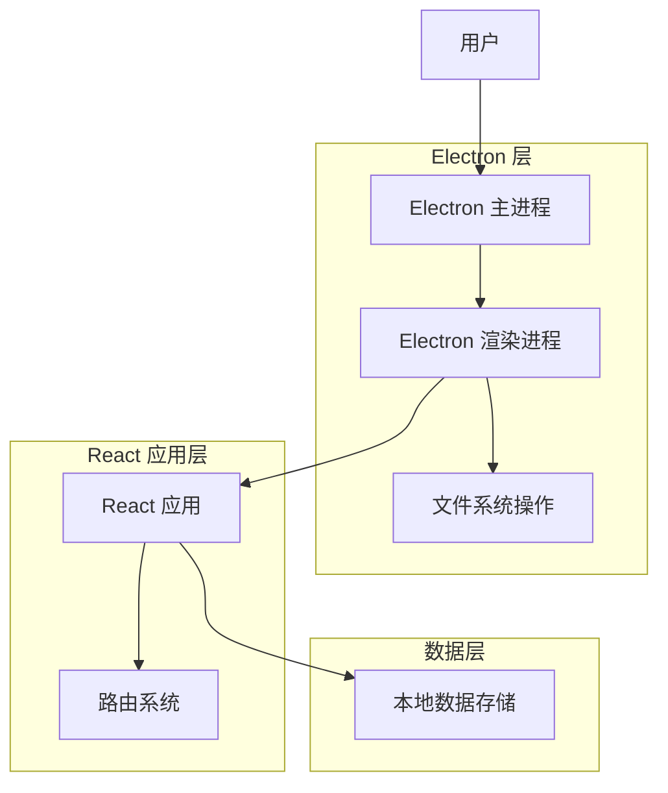

# 小型超市商品价格管理系统 Electron 改造技术文档

## 1. 项目概述

本文档详细说明了将现有的小型超市商品价格管理系统（基于React + Vite构建的Web应用）改造成Electron桌面应用的技术方案。改造后将保持原有功能，并确保路由切换和数据导入导出功能正常运行。

## 2. 架构设计

### 2.1 整体架构



### 2.2 主要组件职责

1. **Electron 主进程**：

   * 创建和管理应用窗口

   * 处理系统级事件

   * 提供文件系统访问API

2. **Electron 渲染进程**：

   * 运行React应用

   * 桥接主进程和渲染进程通信

3. **React 应用**：

   * 保持原有业务逻辑

   * 适配Electron环境下的文件操作

4. **路由系统**：

   * 修改为HashRouter以确保Electron环境下的正确路由

## 3. 技术描述

### 3.1 技术栈

* **前端框架**：React 18

* **构建工具**：Vite 6

* **样式处理**：Tailwind CSS 3

* **UI组件库**：Ant Design 5

* **路由管理**：React Router DOM 7

* **数据存储**：localforage（浏览器本地存储适配）

* **桌面应用框架**：Electron

* **构建工具**：Electron Forge

### 3.2 需要添加的依赖

```bash
# 安装Electron相关依赖
npm install --save-dev electron electron-forge @electron-forge/plugin-vite @electron-forge/maker-zip @electron-forge/maker-squirrel @electron-forge/maker-dmg

# 安装用于主进程和渲染进程通信的工具
npm install electron-ipc-handler

# 安装用于处理文件对话框的工具
npm install electron-dialog
```

## 4. 关键实现方案

### 4.1 Electron 配置与主进程设置

#### 4.1.1 创建主进程文件

在项目根目录创建 `electron/main.js` 文件：

```javascript
const { app, BrowserWindow, dialog, ipcMain } = require('electron');
const path = require('path');
const fs = require('fs');

// 确保应用单例运行
const gotTheLock = app.requestSingleInstanceLock();

if (!gotTheLock) {
  app.quit();
} else {
  app.on('second-instance', (event, commandLine, workingDirectory) => {
    // 当运行第二个实例时，聚焦到第一个实例的窗口
    if (mainWindow) {
      if (mainWindow.isMinimized()) mainWindow.restore();
      mainWindow.focus();
    }
  });

  // 声明主窗口变量
  let mainWindow;

  function createWindow() {
    // 创建浏览器窗口
    mainWindow = new BrowserWindow({
      width: 1200,
      height: 800,
      webPreferences: {
        nodeIntegration: false,
        contextIsolation: true,
        preload: path.join(__dirname, 'preload.js'),
      },
      title: '小型超市商品价格管理系统',
    });

    // 加载应用
    // 在开发模式下加载开发服务器，在生产模式下加载本地HTML文件
    if (process.env.NODE_ENV === 'development') {
      mainWindow.loadURL('http://localhost:5174');
      mainWindow.webContents.openDevTools();
    } else {
      mainWindow.loadFile(path.join(__dirname, '../dist/index.html'));
    }

    // 窗口关闭事件
    mainWindow.on('closed', function () {
      mainWindow = null;
    });
  }

  // 文件操作相关的IPC处理
  ipcMain.handle('showBackupSaveDialog', async () => {
    const result = await dialog.showSaveDialog(mainWindow, {
      title: '保存数据备份',
      defaultPath: `supermarket_backup_${new Date().toLocaleString().replace(/[/:]/g, '-')}.json`,
      filters: [{ name: 'JSON Files', extensions: ['json'] }]
    });
    return result;
  });

  ipcMain.handle('showBackupOpenDialog', async () => {
    const result = await dialog.showOpenDialog(mainWindow, {
      title: '选择备份文件',
      filters: [{ name: 'JSON Files', extensions: ['json'] }],
      properties: ['openFile']
    });
    return result;
  });

  ipcMain.handle('writeBackupFile', async (event, filePath, content) => {
    return new Promise((resolve, reject) => {
      fs.writeFile(filePath, content, 'utf8', (err) => {
        if (err) {
          reject(err);
        } else {
          resolve(true);
        }
      });
    });
  });

  ipcMain.handle('readBackupFile', async (event, filePath) => {
    return new Promise((resolve, reject) => {
      fs.readFile(filePath, 'utf8', (err, data) => {
        if (err) {
          reject(err);
        } else {
          resolve(data);
        }
      });
    });
  });

  // Electron应用生命周期
  app.on('ready', createWindow);

  app.on('window-all-closed', function () {
    if (process.platform !== 'darwin') {
      app.quit();
    }
  });

  app.on('activate', function () {
    if (mainWindow === null) {
      createWindow();
    }
  });
}
```

#### 4.1.2 创建预加载脚本

在项目根目录创建 `electron/preload.js` 文件：

```javascript
const { contextBridge, ipcRenderer } = require('electron');

// 向渲染进程暴露安全的API
contextBridge.exposeInMainWorld('electronAPI', {
  // 文件操作相关API
  showBackupSaveDialog: () => ipcRenderer.invoke('showBackupSaveDialog'),
  showBackupOpenDialog: () => ipcRenderer.invoke('showBackupOpenDialog'),
  writeBackupFile: (filePath, content) => ipcRenderer.invoke('writeBackupFile', filePath, content),
  readBackupFile: (filePath) => ipcRenderer.invoke('readBackupFile', filePath),
});
```

### 4.2 路由系统改造

修改 `src/App.tsx` 文件，将 `BrowserRouter` 替换为 `HashRouter`，以确保在Electron环境中正确处理路由：

```javascript
import React, { useEffect } from 'react';
import {
  HashRouter as Router,
  Routes,
  Route,
  Navigate,
} from 'react-router-dom';
// 其他导入保持不变

function App() {
  // 初始化数据
  useEffect(() => {
    const init = async () => {
      try {
        await initializeData();
      } catch (error) {
        console.error('初始化数据失败:', error);
      }
    };
    init();
  }, []);

  // 集成自动备份功能
  useAutoBackup();

  return (
    <ConfigProvider locale={zhCN}>
      <Router>
        <AppLayout>
          <AutoTimeoutWrapper>
            <Routes>
              {/* 路由配置保持不变 */}
              <Route
                path="/"
                element={<Navigate to="/checkout" replace />}
              />
              <Route
                path="/checkout"
                element={<CheckoutPage />}
              />
              <Route
                path="/products"
                element={<ProductsPage />}
              />
              <Route
                path="/categories"
                element={<CategoriesPage />}
              />
              <Route
                path="/statistics"
                element={<StatisticsPage />}
              />
              <Route path="/orders" element={<OrdersPage />} />
              <Route
                path="/settings"
                element={<SettingsPage />}
              />
            </Routes>
          </AutoTimeoutWrapper>
        </AppLayout>
      </Router>
    </ConfigProvider>
  );
}

export default App;
```

### 4.3 数据导入导出功能调整

修改 `src/db/backupRestore.ts` 文件，适配Electron环境下的文件操作：

```typescript
/* eslint-disable @typescript-eslint/no-explicit-any */

import {
  Product,
  Category,
  Order,
  OrderItem,
  clearCategoryCache,
} from './index';
import { categoryService, productService, orderService } from './index';
import {
  productsStore,
  ordersStore,
  orderItemsStore,
  categoriesStore,
} from './index';

// 定义备份数据的类型
interface BackupData {
  version: string;
  exportTime: string;
  categories: Category[];
  products: Product[];
  orders: Order[];
  orderItems: OrderItem[];
}

// 判断是否在Electron环境中
const isElectron = () => {
  return window && window.process && window.process.type;
};

// 导出所有数据到JSON文件
export const exportData = async (): Promise<void> => {
  try {
    // 获取所有数据
    const categories = await categoryService.getAll();
    const productsResult = await productService.getAll();
    const products = productsResult.list;
    const orders = await orderService.getAllOrders();
    const orderItems = await orderService.getAllOrderItems();

    // 创建备份数据对象
    const backupData: BackupData = {
      version: '1.0',
      exportTime: new Date().toLocaleString(),
      categories,
      products,
      orders,
      orderItems,
    };

    // 转换为JSON字符串
    const jsonString = JSON.stringify(backupData, null, 2);

    if (isElectron() && window.electronAPI) {
      // Electron环境下使用Electron的文件对话框
      const result = await window.electronAPI.showBackupSaveDialog();
      if (!result.canceled && result.filePath) {
        await window.electronAPI.writeBackupFile(result.filePath, jsonString);
      }
    } else {
      // Web环境下使用浏览器的下载功能（保留原有逻辑）
      const blob = new Blob([jsonString], { type: 'application/json' });
      const url = URL.createObjectURL(blob);
      const link = document.createElement('a');
      link.href = url;
      link.download = `supermarket_backup_${new Date().toLocaleString().replace(/[/:]/g, '-')}.json`;
      document.body.appendChild(link);
      link.click();
      document.body.removeChild(link);
      URL.revokeObjectURL(url);
    }
  } catch (error) {
    console.error('导出数据失败:', error);
    throw new Error('导出数据失败，请重试');
  }
};

// 从JSON文件导入数据
export const importData = async (file?: File): Promise<void> => {
  try {
    let jsonData: string;

    if (isElectron() && window.electronAPI && !file) {
      // Electron环境下使用Electron的文件对话框
      const result = await window.electronAPI.showBackupOpenDialog();
      if (result.canceled || result.filePaths.length === 0) {
        throw new Error('未选择文件');
      }
      jsonData = await window.electronAPI.readBackupFile(result.filePaths[0]);
    } else if (file) {
      // Web环境下或传入了File对象时使用FileReader
      jsonData = await new Promise((resolve, reject) => {
        const reader = new FileReader();
        reader.onload = (event) => {
          if (!event.target?.result) {
            reject(new Error('文件读取失败'));
          }
          resolve(event.target.result as string);
        };
        reader.onerror = () => reject(new Error('文件读取错误'));
        reader.readAsText(file);
      });
    } else {
      throw new Error('无法获取文件数据');
    }

    // 解析JSON数据
    const backupData: BackupData = JSON.parse(jsonData);

    // 验证数据格式
    if (!validateBackupData(backupData)) {
      throw new Error('无效的备份文件格式');
    }

    // 清空现有数据
    await clearAllData();

    // 按顺序导入数据（分类->商品->订单->订单项）
    await importCategories(backupData.categories);
    await importProducts(backupData.products);
    await importOrders(backupData.orders);
    await importOrderItems(backupData.orderItems);

  } catch (error) {
    console.error('导入数据失败:', error);
    throw new Error(
      `导入数据失败: ${error instanceof Error ? error.message : '未知错误'}`
    );
  }
};

// 验证备份数据格式
const validateBackupData = (data: any): boolean => {
  return (
    data &&
    typeof data.version === 'string' &&
    typeof data.exportTime === 'string' &&
    Array.isArray(data.categories) &&
    Array.isArray(data.products) &&
    Array.isArray(data.orders) &&
    Array.isArray(data.orderItems)
  );
};

// 清空所有数据
const clearAllData = async (): Promise<void> => {
  try {
    console.log('开始直接清除所有localforage存储实例的数据...');

    // 直接清除所有localforage存储实例的数据
    clearCategoryCache();
    await productsStore.clear();
    await ordersStore.clear();
    await orderItemsStore.clear();
    await categoriesStore.clear();

    console.log('所有数据已成功清除');
  } catch (error) {
    console.error('清空数据失败:', error);
    throw error;
  }
};

// 导入分类数据
const importCategories = async (categories: Category[]): Promise<void> => {
  for (const category of categories) {
    try {
      await categoryService.recover(category);
    } catch (error) {
      console.error('导入分类失败:', error);
      // 继续导入其他分类，不中断整个过程
    }
  }
};

// 导入商品数据
const importProducts = async (products: Product[]): Promise<void> => {
  for (const product of products) {
    try {
      // 由于add方法不接受id参数，我们需要创建一个新的商品对象
      // 并且需要处理分类ID可能不存在的情况
      await productService.recover(product);
    } catch (error) {
      console.error('导入商品失败:', error);
      // 继续导入其他商品，不中断整个过程
    }
  }
};

// 导入订单数据
const importOrders = async (orders: Order[]): Promise<void> => {
  for (const order of orders) {
    try {
      await orderService.recoverOrder(order);
    } catch (error) {
      console.error('导入订单失败:', error);
    }
  }
};

// 导入订单项数据
const importOrderItems = async (orderItems: OrderItem[]): Promise<void> => {
  for (const orderItem of orderItems) {
    try {
      await orderService.recoverOrderItem(orderItem);
    } catch (error) {
      console.error('导入订单项失败:', error);
    }
  }
};
```

### 4.4 添加TypeScript类型声明

创建 `src/types/electron.d.ts` 文件，添加Electron API的类型声明：

```typescript
declare global {
  interface Window {
    electronAPI: {
      showBackupSaveDialog: () => Promise<{
        canceled: boolean;
        filePath?: string;
      }>;
      showBackupOpenDialog: () => Promise<{
        canceled: boolean;
        filePaths: string[];
      }>;
      writeBackupFile: (filePath: string, content: string) => Promise<boolean>;
      readBackupFile: (filePath: string) => Promise<string>;
    };
    process?: {
      type?: string;
    };
  }
}

export {}
```

### 4.5 修改package.json配置

更新 `package.json` 文件，添加Electron相关配置和脚本：

```json
{
  "name": "tyf-supermarket",
  "private": false,
  "version": "0.0.0",
  "type": "module",
  "main": "electron/main.js",
  "scripts": {
    "dev": "vite",
    "build": "tsc -b && vite build",
    "lint": "eslint .",
    "preview": "vite preview",
    "check": "tsc -b --noEmit",
    "electron:dev": "cross-env NODE_ENV=development electron .",
    "electron:build": "npm run build && electron-forge make",
    "electron:package": "electron-forge package",
    "electron:make": "electron-forge make"
  },
  "config": {
    "forge": {
      "packagerConfig": {
        "asar": true,
        "icon": "public/favicon.svg",
        "name": "小型超市商品价格管理系统"
      },
      "makers": [
        {
          "name": "@electron-forge/maker-squirrel",
          "config": {
            "name": "小型超市商品价格管理系统"
          }
        },
        {
          "name": "@electron-forge/maker-zip",
          "platforms": [
            "darwin",
            "linux"
          ]
        },
        {
          "name": "@electron-forge/maker-dmg",
          "config": {
            "format": "ULFO"
          }
        }
      ],
      "plugins": [
        [
          "@electron-forge/plugin-vite",
          {
            "build": {
              "config": "vite.config.ts"
            }
          }
        ]
      ]
    }
  },
  "dependencies": {
    // 原有依赖保持不变
  },
  "devDependencies": {
    // 原有依赖保持不变
    "electron": "^29.0.0",
    "electron-forge": "^7.4.0",
    "@electron-forge/plugin-vite": "^7.4.0",
    "@electron-forge/maker-zip": "^7.4.0",
    "@electron-forge/maker-squirrel": "^7.4.0",
    "@electron-forge/maker-dmg": "^7.4.0",
    "cross-env": "^7.0.3"
  }
}
```

### 4.6 修改Vite配置

更新 `vite.config.ts` 文件，确保正确配置输出路径和构建选项：

```typescript
import { defineConfig } from 'vite'
import react from '@vitejs/plugin-react'
import tsconfigPaths from 'vite-tsconfig-paths'

// https://vite.dev/config/
export default defineConfig({
  plugins: [react(), tsconfigPaths()],
  build: {
    outDir: 'dist',
    assetsDir: 'assets',
    sourcemap: false,
    rollupOptions: {
      output: {
        entryFileNames: '[name].js',
        chunkFileNames: 'chunks/[name]-[hash].js',
        assetFileNames: 'assets/[name]-[hash].[ext]'
      }
    }
  },
  resolve: {
    alias: {
      '@': '/src'
    }
  }
})
```

## 5. 构建和运行流程

### 5.1 开发模式

1. 首先启动Vite开发服务器：

   ```bash
   npm run dev
   ```

2. 然后在另一个终端启动Electron应用：

   ```bash
   npm run electron:dev
   ```

### 5.2 构建和打包

1. 构建React应用和Electron应用：

   ```bash
   npm run electron:build
   ```

2. 仅打包应用（不生成安装包）：

   ```bash
   npm run electron:package
   ```

3. 生成安装包（根据当前操作系统自动选择合适的格式）：

   ```bash
   npm run electron:make
   ```

## 6. 注意事项

1. **数据存储**：应用的数据仍然存储在localStorage和localforage中，在Electron环境下这些数据存储在用户的应用数据目录中。

2. **多平台支持**：Electron应用可以打包为Windows、macOS和Linux平台的安装包，具体配置已在package.json中设置。

3. **性能优化**：对于大型数据集合的导入导出操作，应当考虑添加进度提示和分批处理逻辑，避免UI阻塞。

4. **安全考虑**：Electron应用需要注意安全问题，特别是在处理文件操作和外部数据时，应当添加适当的验证和错误处理。

5. **自动备份**：自动备份功能需要调整为使用Electron的文件系统API，以确保在桌面环境下正常工作。

通过以上改造方案，现有的小型超市商品价格管理系统可以顺利转换为Electron桌面应用，同时保持所有原有功能的正常运行。
