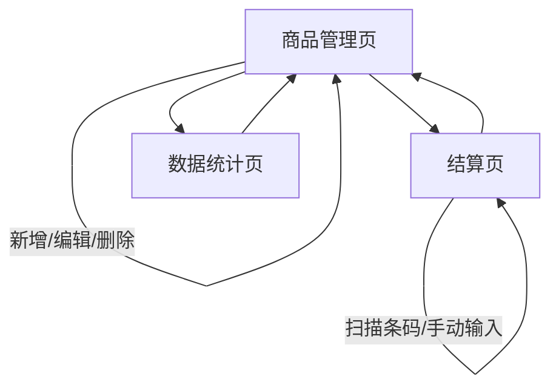

## 1. 产品概述

小型超市商品价格管理系统用于管理带有条码的商品价格信息，支持商品信息的增删改查和结算时的价格统计。
主要目的是解决小型超市人工记录商品价格效率低、容易出错的问题，帮助超市管理员更高效地管理商品价格，同时方便结算流程。
目标是成为小型超市日常运营中简单易用的商品价格管理工具。

## 2. 核心 Features

### 2.1 用户 Roles

| Role | 注册方法         | 核心权限            |
| ---- | ------------ | --------------- |
| 管理员  | 无需注册（系统默认内置） | 管理所有商品信息、进行结算操作 |

### 2.2 Feature Module

我们的小型超市商品价格管理系统需求由以下主要页面组成：

1. **商品管理页**：商品列表展示、新增商品、编辑商品、删除商品、商品条码扫描输入。
2. **结算页**：商品条码扫描、手动输入商品、结算清单展示、总价计算。
3. **数据统计页**：销售额统计、商品销售排行。

### 2.3 Page Details

| 页面名称  | 模块名称   | 功能描述                                          |
| ----- | ------ | --------------------------------------------- |
| 商品管理页 | 商品列表   | 展示所有商品信息，包括商品名称、条码、价格、库存等；支持按名称、条码搜索；支持列表排序。  |
| 商品管理页 | 新增商品   | 提供表单输入商品名称、条码、价格、库存等信息；支持手动输入条码或扫描条码枪输入。      |
| 商品管理页 | 编辑商品   | 支持修改已存在商品的各项信息。                               |
| 商品管理页 | 删除商品   | 支持删除不需要的商品信息。                                 |
| 结算页   | 商品录入   | 支持通过扫描条码枪或手动输入商品条码快速添加商品到结算清单。                |
| 结算页   | 结算清单   | 实时展示当前结算商品列表，包括商品名称、单价、数量、小计；支持修改商品数量；支持移除商品。 |
| 结算页   | 总价计算   | 自动计算并显示当前结算清单的商品总价。                           |
| 数据统计页 | 销售额统计  | 展示每日、每周、每月销售额统计数据，以图表形式呈现。                    |
| 数据统计页 | 商品销售排行 | 展示销售量前N名的商品列表，包括商品名称、销售数量、销售金额。               |

## 3. 核心 Process

### 管理员操作流程

1. 打开系统后进入商品管理页，查看现有商品列表。
2. 需要添加新商品时，点击新增按钮，填写商品信息并保存。
3. 需要修改商品信息时，选择对应商品进行编辑并保存。
4. 进行结算操作时，切换到结算页，通过扫描条码或手动输入添加商品，系统自动计算总价。
5. 需要查看销售数据时，切换到数据统计页，查看销售额统计和商品销售排行。

## 4. User Interface Design

### 4.1 Design Style

* 主色调：使用蓝色系（#1890ff）作为主色调，体现专业性和可靠性

* 辅助色：使用橙色系（#fa8c16）作为辅助色，用于强调重要操作按钮

* 按钮样式：采用圆角矩形按钮，主要操作按钮使用实心填充，次要按钮使用描边样式

* 字体：使用系统默认字体，标题使用16-20px，正文使用14px，辅助文字使用12px

* 布局风格：采用卡片式布局，顶部导航栏固定，左侧菜单可折叠，主内容区域响应式布局

* 图标：使用Ant Design提供的图标库，保持风格统一

### 4.2 Page Design Overview

| 页面名称  | 模块名称    | UI Elements                                       |
| ----- | ------- | ------------------------------------------------- |
| 商品管理页 | 商品列表    | 顶部搜索框、筛选条件；中部商品数据表格，支持列排序、筛选、列宽调整；表格行包含编辑、删除操作按钮。 |
| 商品管理页 | 新增/编辑商品 | 模态弹窗形式，包含商品信息输入表单，支持条码扫描输入；提交、取消按钮。               |
| 结算页   | 商品录入区域  | 大型条码输入框，支持键盘输入和条码枪扫描；快速添加按钮。                      |
| 结算页   | 结算清单    | 表格形式展示已选商品，包含商品信息和数量调整控件；底部显示商品总价。                |
| 数据统计页 | 销售额统计   | 图表展示区域，包含时间范围选择器；下方显示具体销售数据表格。                    |
| 数据统计页 | 商品销售排行  | 排行榜表格，显示商品名称、销售数量、销售金额；支持切换显示数量。                  |

### 4.3 Responsiveness

* 采用桌面优先设计，同时支持1024px以上的所有桌面设备

* 针对不同屏幕尺寸，调整表格列数、间距和字体大小

* 菜单在小屏幕设备上可折叠，提供更宽敞的工作区域

* 确保在各种桌面分辨率下，核心功能区域都能正常显示和操作

