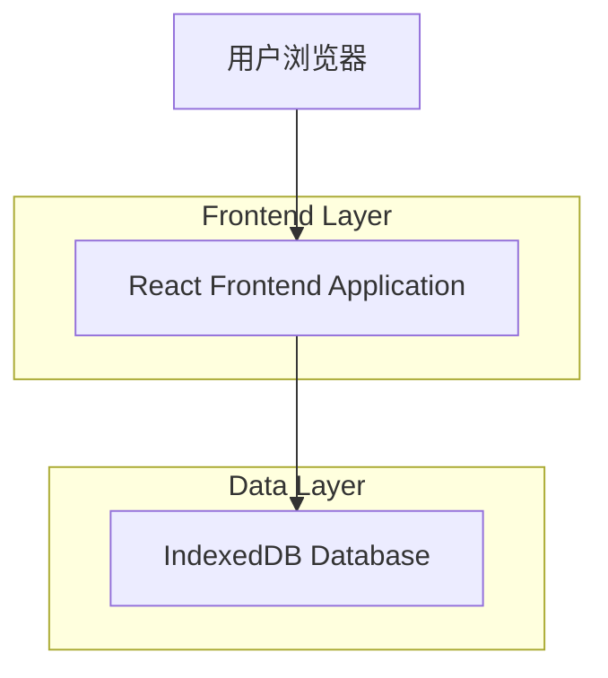
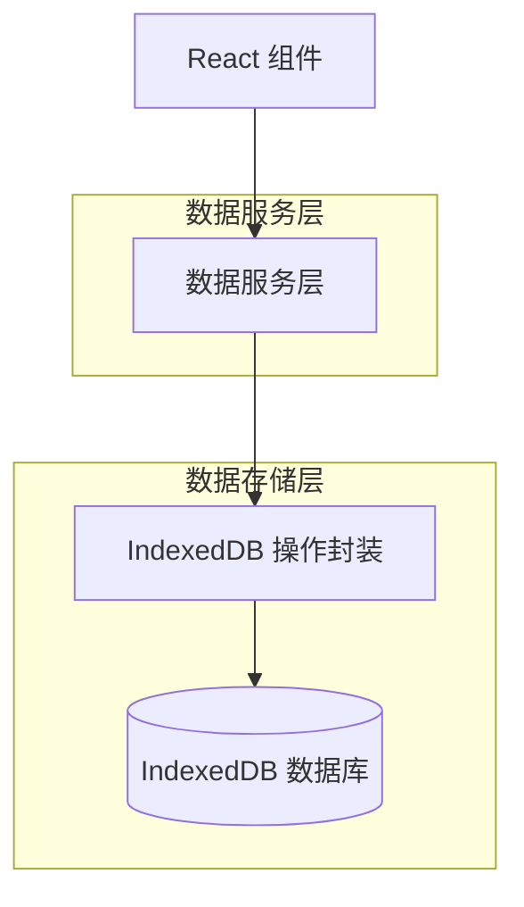
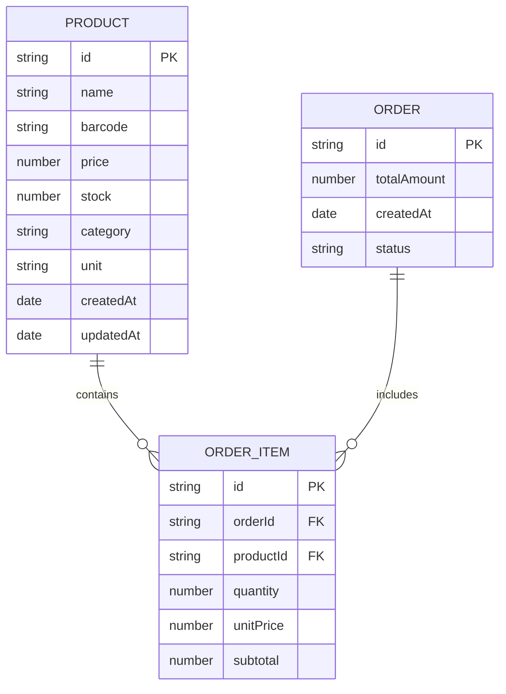

## 1. Architecture design



## 2. 前端技术栈选择与理由

### 2.1 核心技术栈

* **前端框架**: React\@18 + TypeScript

* **构建工具**: Vite

* **UI组件库**: Ant Design\@5

* **状态管理**: React Hooks (useState) + Zustand

* **离线数据存储**: IndexedDB + localForage

* **路由**: React Router\@6

* **表单处理**: Ant Design Form

* **CSS解决方案**: Tailwind CSS

### 2.2 技术选择理由

#### React 18 + TypeScript

* **React 18**：2024年React仍然是前端开发的主流框架，市场占有率高达85%。React 18引入的并发特性和自动批处理功能能够提升应用性能，对于超市结算等高频操作场景尤为重要。<mcreference link="https://juejin.cn/post/7457469362758385714" index="5">5</mcreference>

* **TypeScript**：提供静态类型检查，大幅提高代码质量和开发效率，对于需要处理商品价格、库存等精确数据的场景非常重要，可以有效避免类型错误。

#### Vite

* 相比传统的webpack，Vite提供更快的开发服务器启动速度和热更新能力，显著提升开发体验。

* 对于小型应用，Vite的配置更加简洁，易于上手和维护。

#### Ant Design 5

* 提供丰富的企业级UI组件，如表格、表单、弹窗等，非常适合构建商品管理和结算系统的界面。

* 组件设计规范统一，视觉效果专业，能够快速构建高质量的用户界面。

* 响应式设计支持，能够适应超市不同尺寸的设备屏幕。

#### React Hooks (useState) + Zustand

* **useState**: React内置的基础状态管理钩子，适用于组件内部的简单状态管理。

* **Zustand**: 轻量级的状态管理库，相比Redux等传统状态管理方案更加简洁高效。对于超市商品管理系统，Zustand能够提供全局状态共享，同时保持代码的简洁性和可维护性。它的API设计直观，易于上手，非常适合中小型应用。

#### IndexedDB + localForage

* **IndexedDB**：浏览器内置的离线数据库，支持存储大量结构化数据（通常可达几十MB甚至GB级别），完全满足小型超市的商品和销售数据存储需求。<mcreference link="https://blog.51cto.com/u_11966691/14078989" index="4">4</mcreference>

* 支持事务操作，确保数据的一致性和完整性，这对于处理商品价格和库存等敏感数据至关重要。

* 异步操作模式不会阻塞UI线程，保证结算操作的流畅性。

* **localForage**：优秀的IndexedDB封装库，提供更简洁的API接口，自动处理浏览器兼容性问题，并能在IndexedDB不可用时自动降级到WebSQL或localStorage。<mcreference link="https://m.jb51.net/javascript/3315511up.htm" index="1">1</mcreference>

#### React Router 6

* 提供声明式路由配置，易于管理应用的页面导航。

* 支持嵌套路由和路由参数，能够灵活处理商品详情、结算等页面的跳转逻辑。

#### Ant Design Form

* Ant Design Form组件提供了完整的表单解决方案，包括表单验证、状态管理、表单联动等功能。

* 与Ant Design其他组件完美集成，能够快速构建高质量的商品信息录入表单。

* 内置的表单验证功能能够确保商品价格、库存等数据的准确性。

#### Tailwind CSS

* 实用优先的CSS框架，通过预定义的工具类能够快速构建和定制UI界面。

* 对于超市商品管理系统，Tailwind CSS能够提供灵活的布局方案和响应式设计支持。

* 与React和Ant Design配合使用，能够进一步提升开发效率和UI一致性。

## 3. Route definitions

| Route       | Purpose           |
| ----------- | ----------------- |
| /           | 首页，展示系统概览         |
| /products   | 商品管理页，管理所有商品信息    |
| /checkout   | 结算页，进行商品结算操作      |
| /statistics | 数据统计页，查看销售数据和统计信息 |

## 4. 数据操作方法

### 4.1 商品管理相关方法

#### getProducts

获取所有商品列表

参数:

| Param Name | Param Type | 必需 | Description    |
| ---------- | ---------- | -- | -------------- |
| page       | number     | 否  | 页码，默认1         |
| pageSize   | number     | 否  | 每页条数，默认10      |
| keyword    | string     | 否  | 搜索关键词（商品名称或条码） |

返回值:

| Param Name | Param Type | Description |
| ---------- | ---------- | ----------- |
| list       | array      | 商品列表数据      |
| total      | number     | 商品总条数       |

#### addProduct

创建新商品

参数:

| Param Name | Param Type | 必需 | Description |
| ---------- | ---------- | -- | ----------- |
| name       | string     | 是  | 商品名称        |
| barcode    | string     | 是  | 商品条码        |
| price      | number     | 是  | 商品价格        |
| stock      | number     | 是  | 商品库存        |
| category   | string     | 否  | 商品分类        |
| unit       | string     | 否  | 商品单位        |

返回值: 创建的商品对象

#### updateProduct

更新商品信息

参数:

| Param Name | Param Type | 必需 | Description |
| ---------- | ---------- | -- | ----------- |
| id         | string     | 是  | 商品ID        |
| name       | string     | 否  | 商品名称        |
| barcode    | string     | 否  | 商品条码        |
| price      | number     | 否  | 商品价格        |
| stock      | number     | 否  | 商品库存        |
| category   | string     | 否  | 商品分类        |
| unit       | string     | 否  | 商品单位        |

返回值: 更新后的商品对象

#### deleteProduct

删除商品

参数:

| Param Name | Param Type | 必需 | Description |
| ---------- | ---------- | -- | ----------- |
| id         | string     | 是  | 商品ID        |

返回值: 操作结果（布尔值）

#### getProductByBarcode

通过条码查询商品

参数:

| Param Name | Param Type | 必需 | Description |
| ---------- | ---------- | -- | ----------- |
| barcode    | string     | 是  | 商品条码        |

返回值: 商品对象或null

### 4.2 结算相关方法

#### createOrder

创建结算订单

参数:

| Param Name      | Param Type | 必需 | Description |
| --------------- | ---------- | -- | ----------- |
| items           | array      | 是  | 结算商品列表      |
| items.productId | string     | 是  | 商品ID        |
| items.quantity  | number     | 是  | 购买数量        |
| totalAmount     | number     | 是  | 订单总金额       |

返回值: 创建的订单对象

### 4.3 统计相关方法

#### getSalesStatistics

获取销售统计数据

参数:

| Param Name | Param Type | 必需 | Description          |
| ---------- | ---------- | -- | -------------------- |
| startDate  | string     | 是  | 开始日期（YYYY-MM-DD）     |
| endDate    | string     | 是  | 结束日期（YYYY-MM-DD）     |
| interval   | string     | 否  | 时间间隔（day/week/month） |

返回值: 销售统计数据数组

#### getTopProducts

获取热销商品排行

参数:

| Param Name | Param Type | 必需 | Description      |
| ---------- | ---------- | -- | ---------------- |
| limit      | number     | 否  | 返回数量，默认10        |
| startDate  | string     | 否  | 开始日期（YYYY-MM-DD） |
| endDate    | string     | 否  | 结束日期（YYYY-MM-DD） |

返回值: 热销商品列表

## 5. 前端数据访问层设计



前端应用采用分层架构设计：

1. React 组件层：负责UI渲染和用户交互
2. 数据服务层：封装业务逻辑，提供统一的数据访问接口
3. IndexedDB 操作封装：使用Dexie.js库封装数据库操作
4. IndexedDB 数据库：浏览器内置的离线存储机制

数据服务层实现了业务逻辑与数据存储的解耦，使得组件只需关注自身的展示逻辑，而不需要直接处理数据库操作。

## 6. 数据模型

### 6.1 数据模型定义



数据模型关系说明：

* 一个商品(PRODUCT)可以包含在多个订单商品(ORDER\_ITEM)中

* 一个订单(ORDER)可以包含多个订单商品(ORDER\_ITEM)

### 6.2 IndexedDB 数据库结构定义

#### 使用localForage定义数据库

```javascript
// src/db/index.js
import localforage from 'localforage';

// 配置localforage
localforage.config({
  name: 'SupermarketPriceSystem',
  storeName: 'supermarket_data', // 数据库默认表名
  description: '小型超市商品价格管理系统数据存储'
});

// 为不同的数据类型创建单独的存储实例
const productsStore = localforage.createInstance({
  name: 'SupermarketPriceSystem',
  storeName: 'products'
});

const ordersStore = localforage.createInstance({
  name: 'SupermarketPriceSystem', 
  storeName: 'orders'
});

const orderItemsStore = localforage.createInstance({
  name: 'SupermarketPriceSystem',
  storeName: 'order_items'
});

// 商品操作服务
const productService = {
  // 获取所有商品
  getAll: async (page = 1, pageSize = 10, keyword = '') => {
    try {
      // 获取所有商品数据
      let allProducts = [];
      await productsStore.iterate((value) => {
        allProducts.push(value);
      });
      
      // 关键词搜索
      if (keyword) {
        const lowerKeyword = keyword.toLowerCase();
        allProducts = allProducts.filter(product => 
          product.name.toLowerCase().includes(lowerKeyword) || 
          product.barcode.includes(keyword)
        );
      }
      
      // 按创建时间排序（降序）
      allProducts.sort((a, b) => new Date(b.createdAt) - new Date(a.createdAt));
      
      // 分页处理
      const total = allProducts.length;
      const startIndex = (page - 1) * pageSize;
      const list = allProducts.slice(startIndex, startIndex + pageSize);
      
      return { list, total };
    } catch (error) {
      console.error('获取商品列表失败:', error);
      return { list: [], total: 0 };
    }
  },
  
  // 通过条码获取商品
  getByBarcode: async (barcode) => {
    try {
      let product = null;
      await productsStore.iterate((value) => {
        if (value.barcode === barcode) {
          product = value;
          return true; // 中断迭代
        }
      });
      return product;
    } catch (error) {
      console.error('通过条码查询商品失败:', error);
      return null;
    }
  },
  
  // 添加商品
  add: async (product) => {
    try {
      const now = new Date();
      const newProduct = {
        ...product,
        id: Date.now().toString(), // 生成唯一ID
        createdAt: now.toLocaleString(),
        updatedAt: now.toLocaleString()
      };
      
      await productsStore.setItem(newProduct.id, newProduct);
      return newProduct;
    } catch (error) {
      console.error('添加商品失败:', error);
      throw error;
    }
  },
  
  // 更新商品
  update: async (id, productData) => {
    try {
      const existingProduct = await productsStore.getItem(id);
      if (!existingProduct) {
        throw new Error('商品不存在');
      }
      
      const updatedProduct = {
        ...existingProduct,
        ...productData,
        updatedAt: new Date().toLocaleString()
      };
      
      await productsStore.setItem(id, updatedProduct);
      return updatedProduct;
    } catch (error) {
      console.error('更新商品失败:', error);
      throw error;
    }
  },
  
  // 删除商品
  delete: async (id) => {
    try {
      await productsStore.removeItem(id);
      return true;
    } catch (error) {
      console.error('删除商品失败:', error);
      return false;
    }
  }
};

// 订单操作服务
const orderService = {
  // 创建订单
  create: async (orderData) => {
    try {
      const now = new Date();
      const orderId = Date.now().toString(); // 生成唯一订单ID
      
      // 创建订单
      const order = {
        id: orderId,
        totalAmount: orderData.totalAmount,
        createdAt: now.toLocaleString(),
        status: 'completed'
      };
      
      await ordersStore.setItem(orderId, order);
      
      // 创建订单商品
      const orderItems = orderData.items.map(item => ({
        id: `${orderId}_${item.productId}`,
        orderId,
        productId: item.productId,
        quantity: item.quantity,
        unitPrice: item.unitPrice,
        subtotal: item.subtotal
      }));
      
      // 保存所有订单项
      for (const item of orderItems) {
        await orderItemsStore.setItem(item.id, item);
      }
      
      return { orderId, createdAt: now };
    } catch (error) {
      console.error('创建订单失败:', error);
      throw error;
    }
  },
  
  // 获取销售统计
  getSalesStatistics: async (startDate, endDate, interval = 'day') => {
    try {
      // 实现销售统计逻辑
      let allOrders = [];
      await ordersStore.iterate((value) => {
        allOrders.push(value);
      });
      
      // 按日期筛选订单
      const filteredOrders = allOrders.filter(order => {
        const orderDate = new Date(order.createdAt);
        return orderDate >= new Date(startDate) && orderDate <= new Date(endDate);
      });
      
      // 按时间间隔分组统计（简化实现）
      const statistics = [];
      // ...具体统计逻辑
      
      return statistics;
    } catch (error) {
      console.error('获取销售统计失败:', error);
      return [];
    }
  },
  
  // 获取热销商品排行
  getTopProducts: async (limit = 10, startDate, endDate) => {
    try {
      // 实现热销商品排行逻辑（简化实现）
      const productSales = {};
      
      // 统计每个商品的销售数量和金额
      await orderItemsStore.iterate((item) => {
        const { productId, quantity, subtotal } = item;
        if (!productSales[productId]) {
          productSales[productId] = { quantity: 0, amount: 0 };
        }
        productSales[productId].quantity += quantity;
        productSales[productId].amount += subtotal;
      });
      
      // 转换为数组并排序
      const topProducts = Object.entries(productSales)
        .map(([productId, data]) => ({ productId, ...data }))
        .sort((a, b) => b.quantity - a.quantity)
        .slice(0, limit);
      
      return topProducts;
    } catch (error) {
      console.error('获取热销商品排行失败:', error);
      return [];
    }
  }
};

export { productService, orderService };
```

#### 订单项表 (order\_items)

```javascript
// MongoDB Schema Definition
const orderItemSchema = new mongoose.Schema({
  orderId: {
    type: mongoose.Schema.Types.ObjectId,
    ref: 'Order',
    required: true
  },
  productId: {
    type: mongoose.Schema.Types.ObjectId,
    ref: 'Product',
    required: true
  },
  quantity: {
    type: Number,
    required: true,
    min: 1
  },
  unitPrice: {
    type: Number,
    required: true,
    min: 0
  },
  subtotal: {
    type: Number,
    required: true,
    min: 0
  }
});

// 创建索引
orderItemSchema.index({ orderId: 1 });
orderItemSchema.index({ productId: 1 });
```

